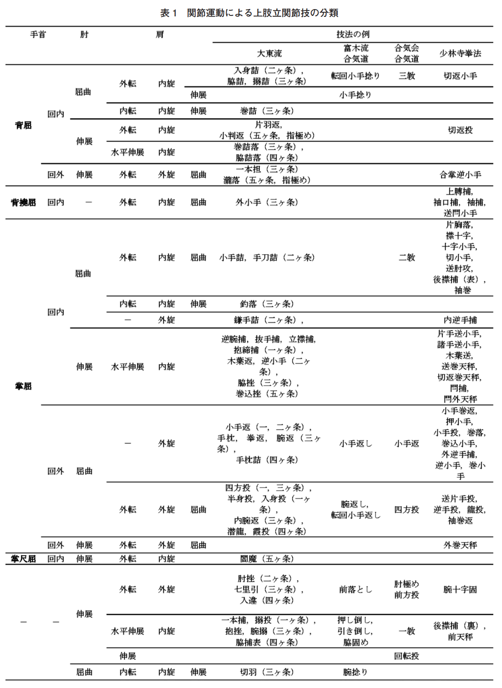
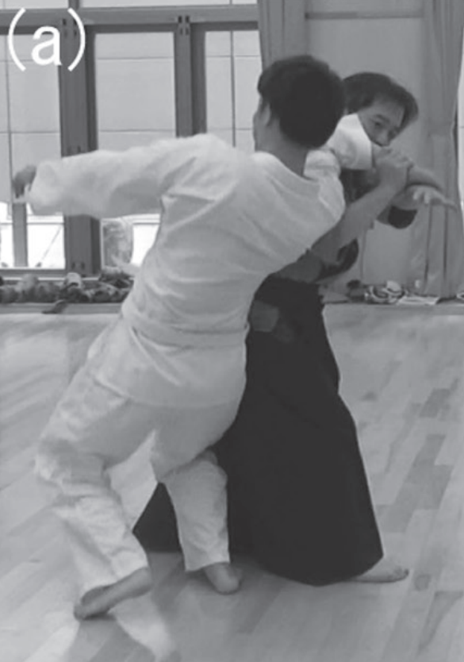
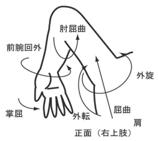
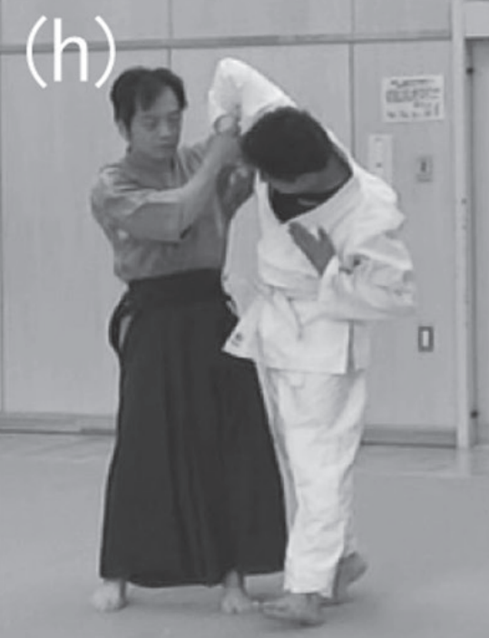
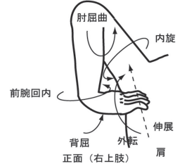
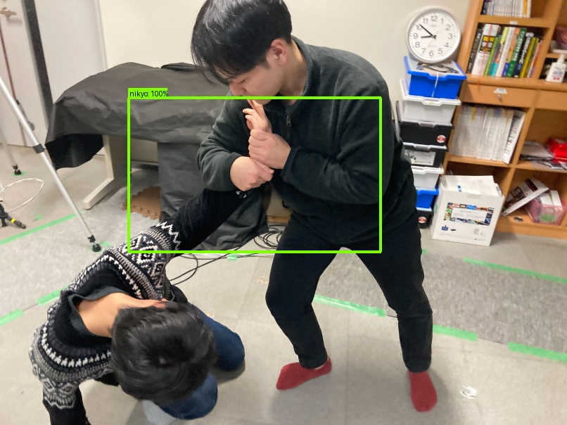
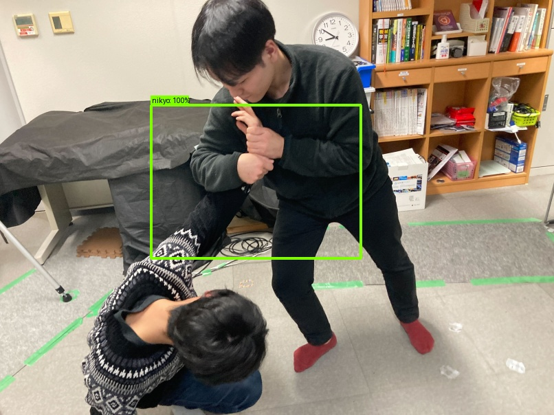
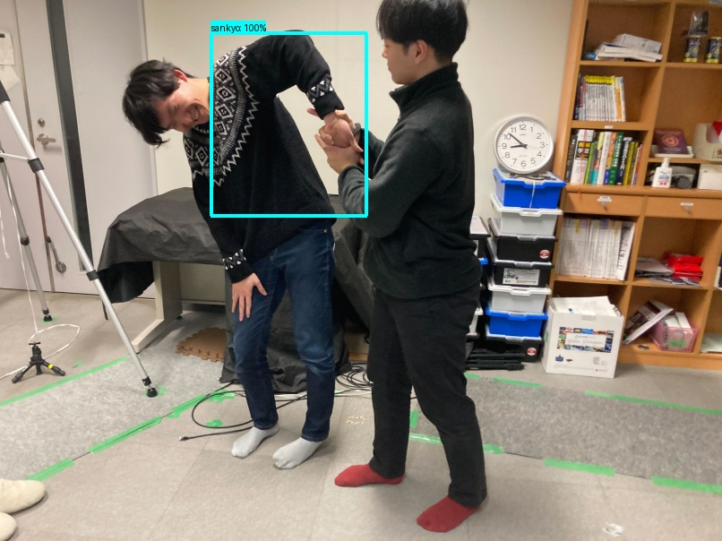
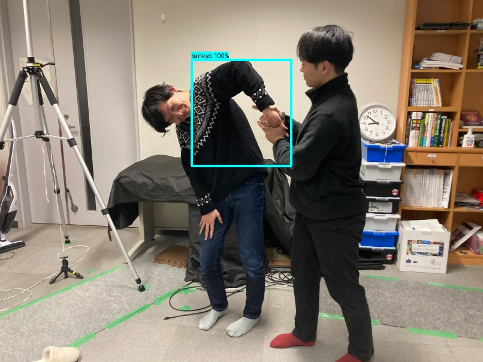

# 合気道の技の種類判定
## 背景
日本の伝統武道である合気道には演武という技を披露する機会があるが、合気道をやったことない観客にとっては何が起きているかよくわからず、「なにがすごいのかわからない」という感想になることがある。
これは普段から合気道を稽古する私にとって、とても悔しい。合気道には骨格の弱点や重心移動を利用することで身体の小さい人が大きい人に勝つ理合がある。
合気道家はその理合を体得するために、先人が残した「型」をひたすら繰り返し稽古する。その型稽古を対外的に披露する舞台が「演武」であり、合気道のことを外部の人に知ってもらう絶好のチャンスである。
演武で合気道の技を観客に理解してもらうために、リアルタイムで技を解説するシステムを開発したい。
その第一歩として、物体検知モデルである"Tensorflow Object Detection API"を用いて、技の種類を判定するアプリを開発する。

## 合気道の関節技
合気道には多数の上肢立関節技があり、代表的な技である「小手返し」では相手の手首を回外・掌屈、肘を屈曲、肩を外旋させることで相手を投げる[1]。
他にも、手首を掌屈・回外、肘を屈曲、肩を外転・外旋させる「四方投」や、手首を回内・背屈、肘を屈曲、肩を外転・内旋させる「三教」などの技がある(図は[1]より引用)。









## 合気道の流し技
合気道の技には、上肢立関節技だけでなく、相手の攻撃を受け流しながら相手の重心を崩して投げる技もある。代表的な技に「呼吸投げ」とよばれる、相手の攻撃のタイミングと力の向きに合わせて相手を投げる技がある。

## データの収集とモデル作成
### 演武の動画から、技が決まる瞬間の画像を取得する。  
```$ pip install -r Tensorflow/labelImg/requirements/requirements-linux-python3.txt```  
```$ python Tensorflow/labelImg/labelImg.py```

### 技が決まる瞬間の姿勢に技の種類のラベルを付け、トレーニング用とテスト用に振り分ける。
### Tensorflow Object Detection APIを用いて、物体検知モデルを作成する。

#### Labelmapを作成
```$ python create_label.py```  

#### TFrecordを作成
```$ python Tensorflow/scripts/generate_tfrecord.py -x Tensorflow/workspace/images/train -l Tensorflow/workspace/annotations/label_map.pbtxt -o Tensorflow/workspace/annotations/train.record```  
```$ python Tensorflow/scripts/generate_tfrecord.py -x Tensorflow/workspace/images/test -l Tensorflow/workspace/annotations/label_map.pbtxt -o Tensorflow/workspace/annotations/test.record```

#### Model configを作成
```$ mkdir Tensorflow\workspace\modelsmy_ssd_mobnet```  
```$ cp Tensorflow/workspace/pre-trained-models/ssd_mobilenet_v2_fpnlite_320x320_coco17_tpu-8/pipeline.config Tensorflow/workspace/models/my_ssd_mobnet```

#### Model configを更新
```$ python update_config.py```  

#### Modelを学習 
```$ export PYTHONPATH=$PYTHONPATH:$/Tensorflow/models/```  
```$ python Tensorflow/models/research/object_detection/model_main_tf2.py --model_dir=Tensorflow/workspace/models/my_ssd_mobnet --pipeline_config_path=Tensorflow/workspace/models/my_ssd_mobnet/pipeline.config --num_train_steps=5000```  

## 検証結果

<!--  -->


<!--  -->


## 参考文献
[1]江夏怜. (2022). 日本武術の上肢立関節技における関節運動方向による分類. 武道学研究, 54(2), 141-148.